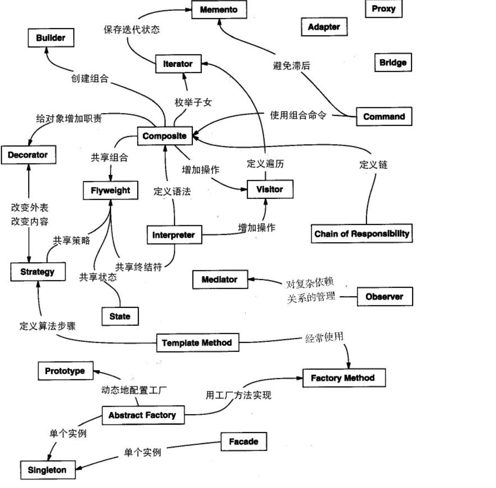

### 设计模式

#### 简述

+ 设计模式（Design pattern）代表了最佳的实践，通常被有经验的面向对象的软件开发人员所采用。设计模式是软件开发人员在软件开发过程中面临的一般问题的解决方案。这些解决方案是众多软件开发人员经过相当长的一段时间的试验和错误总结出来的
+ <a href="https://www.runoob.com/design-pattern/design-pattern-intro.html">参考链接</a>
+ GOF(四人帮，Gang of Four)
  + 在 1994 年，由 Erich Gamma、Richard Helm、Ralph Johnson 和 John Vlissides 四人合著出版了一本名为 **Design Patterns - Elements of Reusable Object-Oriented Software（中文译名：设计模式 - 可复用的面向对象软件元素）** 的书，该书首次提到了软件开发中设计模式的概念。四位作者合称 **GOF（四人帮，全拼 Gang of Four）**。他们所提出的设计模式主要是基于以下的面向对象设计原则。
    + 对接口编程而不是对实现编程。
    + 优先使用对象组合而不是继承。

#### 设计模式类型

+ 根据设计模式的参考书 **Design Patterns - Elements of Reusable Object-Oriented Software（中文译名：设计模式 - 可复用的面向对象软件元素）** 中所提到的，总共有 23 种设计模式。这些模式可以分为三大类：创建型模式（Creational Patterns）、结构型模式（Structural Patterns）、行为型模式（Behavioral Patterns），额外还有一类**J2EE 模式**
+ **创建型模式**
  + 简述：这些设计模式提供了一种在创建对象的同时隐藏创建逻辑的方式，而不是使用 new 运算符直接实例化对象。这使得程序在判断针对某个给定实例需要创建哪些对象时更加灵活。
  + 代表
    + 工厂模式（Factory Pattern）
    + 抽象工厂模式（Abstract Factory Pattern）
    + 单例模式（Singleton Pattern）
    + 建造者模式（Builder Pattern）
    + 原型模式（Prototype Pattern）
+ **结构型模式**
  + 简述：这些设计模式关注类和对象的组合。继承的概念被用来组合接口和定义组合对象获得新功能的方式。
  + 代表
    + 适配器模式（Adapter Pattern）
    + 桥接模式（Bridge Pattern）
    + 过滤器模式（Filter、Criteria Pattern）
    + 组合模式（Composite Pattern）
    + 装饰器模式（Decorator Pattern）
    + 外观模式（Facade Pattern）
    + 享元模式（Flyweight Pattern）
    + 代理模式（Proxy Pattern）
+ **行为型模式**
  + 简述：这些设计模式特别关注对象之间的通信。
  + 代表
    + 责任链模式（Chain of Responsibility Pattern）
    + 命令模式（Command Pattern）
    + 解释器模式（Interpreter Pattern）
    + 迭代器模式（Iterator Pattern）
    + 中介者模式（Mediator Pattern）
    + 备忘录模式（Memento Pattern）
    + 观察者模式（Observer Pattern）
    + 状态模式（State Pattern）
    + 空对象模式（Null Object Pattern）
    + 策略模式（Strategy Pattern）
    + 模板模式（Template Pattern）
    + 访问者模式（Visitor Pattern）
+ **J2EE 模式**
  + 简述：这些设计模式特别关注表示层。这些模式是由 Sun Java Center 鉴定的。
  + 代表
    + MVC 模式（MVC Pattern）
    + 业务代表模式（Business Delegate Pattern）
    + 组合实体模式（Composite Entity Pattern）
    + 数据访问对象模式（Data Access Object Pattern）
    + 前端控制器模式（Front Controller Pattern）
    + 拦截过滤器模式（Intercepting Filter Pattern）
    + 服务定位器模式（Service Locator Pattern）
    + 传输对象模式（Transfer Object Pattern）
+ 设计模式的六大原则
  + **开闭原则（Open Close Principle）**
    + 开闭原则的意思是：**对扩展开放，对修改关闭**。在程序需要进行拓展的时候，不能去修改原有的代码，实现一个热插拔的效果。简言之，是为了使程序的扩展性好，易于维护和升级。想要达到这样的效果，我们需要使用接口和抽象类，后面的具体设计中我们会提到这点。
  + **里氏代换原则（Liskov Substitution Principle）**
    + 里氏代换原则是面向对象设计的基本原则之一。 里氏代换原则中说，任何基类可以出现的地方，子类一定可以出现。LSP 是继承复用的基石，只有当派生类可以替换掉基类，且软件单位的功能不受到影响时，基类才能真正被复用，而派生类也能够在基类的基础上增加新的行为。里氏代换原则是对开闭原则的补充。实现开闭原则的关键步骤就是抽象化，而基类与子类的继承关系就是抽象化的具体实现，所以里氏代换原则是对实现抽象化的具体步骤的规范。
  + **依赖倒转原则（Dependence Inversion Principle）**
    + 这个原则是开闭原则的基础，具体内容：针对接口编程，依赖于抽象而不依赖于具体。
  + **接口隔离原则（Interface Segregation Principle）**
    + 这个原则的意思是：使用多个隔离的接口，比使用单个接口要好。它还有另外一个意思是：降低类之间的耦合度。由此可见，其实设计模式就是从大型软件架构出发、便于升级和维护的软件设计思想，它强调降低依赖，降低耦合。
  + **迪米特法则，又称最少知道原则（Demeter Principle）**
    + 最少知道原则是指：一个实体应当尽量少地与其他实体之间发生相互作用，使得系统功能模块相对独立。
  + **合成复用原则（Composite Reuse Principle）**
    + 合成复用原则是指：尽量使用合成/聚合的方式，而不是使用继承。
+ 各设计模式之间的关系
  + </img>

#### 各个设计模式

##### 工厂模式

+ 简述：工厂模式（Factory Pattern）是 Java 中最常用的设计模式之一。这种类型的设计模式属于创建型模式，它提供了一种创建对象的最佳方式。在工厂模式中，我们在创建对象时不会对客户端暴露创建逻辑，并且是通过使用一个共同的接口来指向新创建的对象。

+ 介绍:

  + 意图：**定义一个创建对象的接口，让其子类自己决定实例化哪一个工厂类，工厂模式使其创建过程延迟到子类进行。

  + **主要解决：**主要解决接口选择的问题。

  + **何时使用：**我们明确地计划不同条件下创建不同实例时。

  + **如何解决：**让其子类实现工厂接口，返回的也是一个抽象的产品。

  + **关键代码：**创建过程在其子类执行。

  + **应用实例：** 

    1、您需要一辆汽车，可以直接从工厂里面提货，而不用去管这辆汽车是怎么做出来的，以及这个汽车里面的具体实现。

    2、Hibernate 换数据库只需换方言和驱动就可以。

  + **优点：** 

    1、一个调用者想创建一个对象，只要知道其名称就可以了。

    2、扩展性高，如果想增加一个产品，只要扩展一个工厂类就可以。 

    3、屏蔽产品的具体实现，调用者只关心产品的接口。

  + **缺点：**每次增加一个产品时，都需要增加一个具体类和对象实现工厂，使得系统中类的个数成倍增加，在一定程度上增加了系统的复杂度，同时也增加了系统具体类的依赖。这并不是什么好事。

  + **使用场景：** 

    1、日志记录器：记录可能记录到本地硬盘、系统事件、远程服务器等，用户可以选择记录日志到什么地方。 

    2、数据库访问，当用户不知道最后系统采用哪一类数据库，以及数据库可能有变化时。 

    3、设计一个连接服务器的框架，需要三个协议，"POP3"、"IMAP"、"HTTP"，可以把这三个作为产品类，共同实现一个接口。

  + **注意事项：**作为一种创建类模式，在任何需要生成复杂对象的地方，都可以使用工厂方法模式。有一点需要注意的地方就是复杂对象适合使用工厂模式，而简单对象，特别是只需要通过 new 就可以完成创建的对象，无需使用工厂模式。如果使用工厂模式，就需要引入一个工厂类，会增加系统的复杂度。

  + 实现（详细见helloDataStructure-design-singlefactory）：

    ```
    * 1.创建接口
    * 2.根据需求创建接口的实现类
    * 3.创建工厂，生成基于给定信息的实现类对象
    * 4.调用工厂，通过传递类型信息获取实现类对象
    ```

##### 抽象工厂模式

+ 简述：

  + 抽象工厂模式（Abstract Factory Pattern）是围绕一个超级工厂创建其他工厂。该超级工厂又称为其他工厂的工厂。这种类型的设计模式属于创建型模式，它提供了一种创建对象的最佳方式。
  + 在抽象工厂模式中，接口是负责创建一个相关对象的工厂，不需要显式指定它们的类。每个生成的工厂都能按照工厂模式提供对象。

+ 介绍：

  + **意图：**提供一个创建一系列相关或相互依赖对象的接口，而无需指定它们具体的类。

  + **主要解决：**主要解决接口选择的问题。

  + **何时使用：**系统的产品有多于一个的产品族，而系统只消费其中某一族的产品。

  + **如何解决：**在一个产品族里面，定义多个产品。

  + **关键代码：**在一个工厂里聚合多个同类产品。

  + **应用实例：**工作了，为了参加一些聚会，肯定有两套或多套衣服吧，比如说有商务装（成套，一系列具体产品）、时尚装（成套，一系列具体产品），甚至对于一个家庭来说，可能有商务女装、商务男装、时尚女装、时尚男装，这些也都是成套的，即一系列具体产品。假设一种情况（现实中是不存在的，要不然，没法进入共产主义了，但有利于说明抽象工厂模式），在您的家中，某一个衣柜（具体工厂）只能存放某一种这样的衣服（成套，一系列具体产品），每次拿这种成套的衣服时也自然要从这个衣柜中取出了。用 OOP 的思想去理解，所有的衣柜（具体工厂）都是衣柜类的（抽象工厂）某一个，而每一件成套的衣服又包括具体的上衣（某一具体产品），裤子（某一具体产品），这些具体的上衣其实也都是上衣（抽象产品），具体的裤子也都是裤子（另一个抽象产品）。

  + **优点：**当一个产品族中的多个对象被设计成一起工作时，它能保证客户端始终只使用同一个产品族中的对象。

  + **缺点：**产品族扩展非常困难，要增加一个系列的某一产品，既要在抽象的 Creator 里加代码，又要在具体的里面加代码。

  + **使用场景：** 

    1、QQ 换皮肤，一整套一起换。 

    2、生成不同操作系统的程序。

  + **注意事项：**产品族难扩展，产品等级易扩展。

+ 实现

  + 具体见（helloDataStructure-design-abstractFactory）

    ```
    * 1.根据需求分别创建几个接口shape,color
    * 2.编写接口的实体类
    * 3.创建抽象类，通过编写抽象方法获取工厂abstractFactory
    * 4.创建扩展了 AbstractFactory 的工厂类，基于给定的信息生成实体类的对象。ColorFactory,ShapeFactory
    * 5.创建一个工厂创造器/生成器类，通过传递信息来获取不同工厂。FactoryProducer
    * 6.使用 FactoryProducer 来获取 AbstractFactory，通过传递类型信息来获取实体类的对象。
    ```

##### 单例设计模式

+ 简述

  + 单例模式（Singleton Pattern）是 Java 中最简单的设计模式之一。这种类型的设计模式属于创建型模式，它提供了一种创建对象的最佳方式。
  + 这种模式涉及到一个单一的类，该类负责创建自己的对象，同时确保只有单个对象被创建。这个类提供了一种访问其唯一的对象的方式，可以直接访问，不需要实例化该类的对象。
  + 注意
    + 单例类只能有一个实例。
    + 单例类必须自己创建自己的唯一实例。
    + 单例类必须给所有其他对象提供这一实例。

+ 介绍

  + **意图：**保证一个类仅有一个实例，并提供一个访问它的全局访问点。

    **主要解决：**一个全局使用的类频繁地创建与销毁。

    **何时使用：**当您想控制实例数目，节省系统资源的时候。

    **如何解决：**判断系统是否已经有这个单例，如果有则返回，如果没有则创建。

    **关键代码：**构造函数是私有的。

    **应用实例：**

    - 一个班级只有一个班主任。
    - Windows 是多进程多线程的，在操作一个文件的时候，就不可避免地出现多个进程或线程同时操作一个文件的现象，所以所有文件的处理必须通过唯一的实例来进行。
    - 一些设备管理器常常设计为单例模式，比如一个电脑有两台打印机，在输出的时候就要处理不能两台打印机打印同一个文件。

    **优点：**

    - 在内存里只有一个实例，减少了内存的开销，尤其是频繁的创建和销毁实例（比如管理学院首页页面缓存）。
    - 避免对资源的多重占用（比如写文件操作）。

    **缺点：**没有接口，不能继承，与单一职责原则冲突，一个类应该只关心内部逻辑，而不关心外面怎么样来实例化。

    **使用场景：**

    - 要求生产唯一序列号。
    - WEB 中的计数器，不用每次刷新都在数据库里加一次，用单例先缓存起来。
    - 创建的一个对象需要消耗的资源过多，比如 I/O 与数据库的连接等。

+ 实现

  + 见helloDataStructure-design-singleton
  + 主要分为饿汉式和懒汉式

