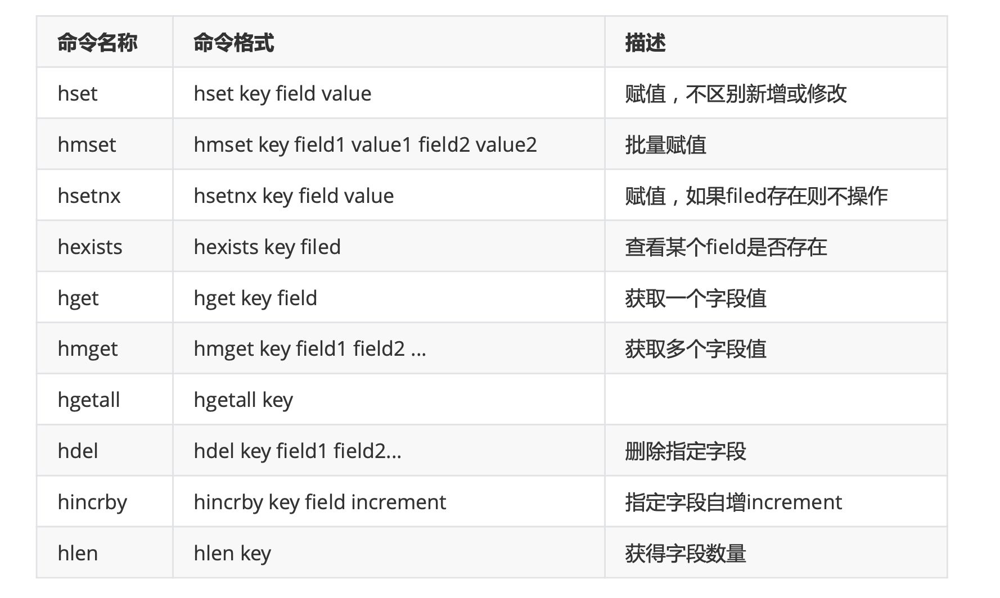
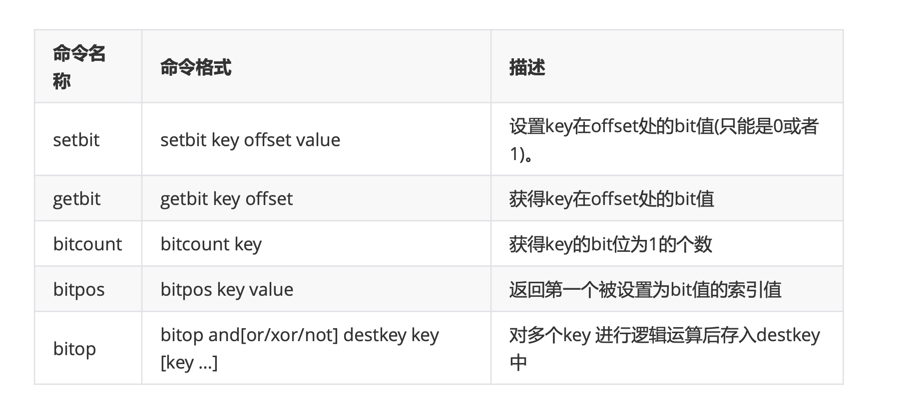

### redis

#### redis快速实战

##### 缓存原理与设计

+ 缓存基本思想
+ 缓存的优势和代价
+ 缓存的读写模式
+ 缓存架构的设计思路

##### redis简介与安装

+ 简介

+ 安装

  + 基础环境配置
 ```linux
  ### 安装gcc
    yum  install -y gcc-c++
    yum install -y wget
 
    ### 下载软件包
    wget http://download.redis.io/releases/redis-5.0.5.tar.gz
  tar -zxf redis-5.0.5.tar.gz
  
    ### 编译
    cd redis-5.0.5/src
    make
  
    ### 指定安装位置
    mkdir  /usr/redis -p
    make   install PREFIX=/usr/redis
  
    ### 直接启动
    cd /usr/redis/bin
    ./redis-server
 ```

  + 后台静默启动
  
    ```shell
    cp  redis-5.0.5/redis.conf /usr/redis/bin/
    vim redis.conf
    
    # 将`daemonize`由`no`改为`yes` 
    daemonize yes
    # 默认绑定的是回环地址，默认不能被其他机器访问 # bind 127.0.0.1
    # 是否开启保护模式，由yes该为no 
    protected-mode no
    
    ./redis-server redis.conf
    ```
  
    
  
  + 关闭方式
  
    ```shell
    ./redis-cli shutdown
    ```
    
  + 其他
  
    ```shell
    redis-server :启动redis服务 
    redis-cli :进入redis命令客户端 
    redis-benchmark : 性能测试的工具
    redis-check-aof: aof 文件进行检查的工具 
    redis-check-dump : rdb 文件进行检查的工具
    redis-sentinel : 启动哨兵监控服务
    ```
  
    
  
    

redis客户端访问

+ java访问
+ spring访问
+ springboot访问（见工具集合）

##### redis数据类型选择与应用场景

+ 基础介绍

  ```txt
  Redis是一个Key-Value的存储系统，使用ANSI C语言编写。
  key的类型是字符串。
  value的数据类型有:
  	常用的:string字符串类型、list列表类型、set集合类型、sortedset(zset)有序集合类型、hash类 型。
  	不常见的:bitmap位图类型、geo地理位置类型。
  	Redis5.0新增一种:stream类型
  注意:Redis中命令是忽略大小写，(set SET)，key是不忽略大小写的 (NAME name)
  ```

+ key设计

  ```txt
  1. 用:分割
  2. 把表名转换为key前缀, 比如: user: 
  3. 第二段放置主键值（注意是值）
  4. 第三段放置列名（列名）
  以user表为例： 
  userid	username	password	email
  9				luna			1223			123@qq.com
  如果取想要取指定用户名称   user:9:username
  如果取想要取指定用户邮箱   user:9:email
  ```

+ string字符串

  + Redis的String能表达3种值的类型:字符串、整数、浮点数 100.01 是个六位的串

    ```txt
    常见命令
    set: set key value 赋值
    get: get key 取值
    getset: getset key value 取值并赋值
    setnx: setnx key value	当key不存在时才用赋值	set key value NX PX 3000 原子操作，px 设置毫秒数
    append: append key value 向尾部追加值
    strlen: strlen key 获取字符串长度
    incr: incr key 递增数字
    incrby: incrby key increment 增加指定的整数
    decr: decr key 递减数字
    decrby: decrby key decrement 减少指定的整数
    
    应用场景:
    1、key和命令是字符串
    2、普通的赋值
    3、incr用于乐观锁 incr:递增数字，可用于实现乐观锁 watch(事务) 
    4、setnx用于分布式锁 当value不存在时采用赋值，可用于实现分布式锁
    
    举例：
    setnx
    127.0.0.1:6379> setnx name zhangf
    (integer) 1
    127.0.0.1:6379> setnx name zhaoyun
    (integer) 0
    127.0.0.1:6379> get name
    "zhangf"
    
    set
    127.0.0.1:6379> set age 18 NX PX 10000 #如果不存在赋值 有效期10秒
    OK
    127.0.0.1:6379> set age 20 NX #赋值失败
    (nil)
    127.0.0.1:6379> get age #age失效
    (nil)
    127.0.0.1:6379> set age 30 NX PX 10000 #赋值成功
    OK
    127.0.0.1:6379> get age
    "30"
    ```

+ list列表

  + list列表类型可以存储有序、可重复的元素 

  + 获取头部或尾部附近的记录是极快的 

  + list的元素个数最多为2^32-1个(40亿) 

  + 常见操作命令如下表:

    ```txt
    命令名称 						命令格式								描述
    lpush 			lpush key v1 v2 v3 ...		从左侧插入列表
    lpop 							lpop key						从列表左侧取出
    rpush 			rpush key v1 v2 v3 ...		从右侧插入列表	
    rpop 							rpop key						从列表右侧取出
    lpushx 				lpushx key value				将值插入到列表头部
    rpushx 				rpushx key value				将值插入到列表尾部
    blpop					blpop key timeout				从列表左侧取出，当列表为空时阻塞，可以设置最大阻塞时间，单位为秒
    brpop					brpop key timeout				从列表右侧取出，当列表为空时阻塞，可以设置最大阻塞时间，单位为秒
    llen 							llen key						获得列表中元素个数
    lindex 						lindex key 					获得列表中下标为index的元素 index从0开始 
    lrange 			lrange key start end			返回列表中指定区间的元素，区间通过start和end指定
    lrem				lrem key count value			删除列表中与value相等的元素，当count>0时，lrem会从列表左边开始删除;当count<0时， lrem会从列表后边开始删除;当count=0时， lrem删除所有值 为value的元素
    lset				lset key index value			将列表index位置的元素设置成value的值
    ltrim				ltrim key start 					对列表进行修剪，只保留start到end区间
    rpoplpush		rpoplpush key1 key2				从key1列表右侧弹出并插入到key2列表左侧
    brpoplpush	brpoplpush key1 key2 			从key1列表右侧弹出并插入到key2列表左侧，会阻塞
    linsert			linsert key BEFORE/AFTER pivot value		将value插入到列表，且位于值pivot之前或之后
    
    应用：
    1、作为栈或队列使用
    列表有序可以作为栈和队列使用 
    2、可用于各种列表，比如用户列表、商品列表、评论列表等。
    
    127.0.0.1:6379> lpush list:1 1 2 3 4 5 3
    (integer) 5
    127.0.0.1:6379> lrange list:1 0 -1
    1) "5"
    2) "4"
    3) "3"
    4) "2"
    5) "1"
    127.0.0.1:6379> lpop list:1 # 从0开始 "5"
    127.0.0.1:6379> rpop list:1
    "1"
    127.0.0.1:6379> lindex list:1 1
    "3"
    127.0.0.1:6379> lrange list:1 0 -1
    1) "4"
    2) "3"
    3) "2"
    127.0.0.1:6379> lindex list:1 1
    "3"
    127.0.0.1:6379> rpoplpush list:1 list:2
    "2"
    127.0.0.1:6379> lrange list:2 0 -1
    1) "2"
    ```

    

+ set集合

  + Set:无序、唯一元素 集合中最大的成员数为 2^32 - 1

  + 常见命令

    ```txt
    命令名称				命令格式									描述
    sadd		sadd key mem1 mem2 ....				为集合添加新成员
    srem		srem key mem1 mem2 ....				删除集合中指定成员
    smembers			smembers key						获得集合中所有元素
    spop					spop key								返回集合中一个随机元素，并将该元素删除
    srandmember		srandmember key					返回集合中一个随机元素，不会删除该元素
    scard					scard key								获得集合中元素的数量
    sismember			sismember key member		判断元素是否在集合内
    sinter				sinter key1 key2 key3		求多集合的交集
    sdiff					sdiff key1 key2 key3		求多集合的差集
    sunion				sunion key1 key2 key3		求多集合的并集
    应用场景: 适用于不能重复的且不需要顺序的数据结构 
    比如:关注的用户，还可以通过spop进行随机抽奖
    127.0.0.1:6379> sadd set:1 a b c d
    (integer) 4
    127.0.0.1:6379> smembers set:1
    1) "d"
    2) "b"
    3) "a"
    4) "c"
    127.0.0.1:6379> srandmember set:1
    "c"
    127.0.0.1:6379> srandmember set:1
    "b"
    127.0.0.1:6379> sadd set:2 b c r f
    (integer) 4
    127.0.0.1:6379> sinter set:1 set:2
    1) "b"
    2) "c"
    127.0.0.1:6379> spop set:1
    "d"
    127.0.0.1:6379> smembers set:1
    1) "b"
    2) "a"
    3) "c"
    ```

+ sortedSet有序集合

  + 简介

    ```txt
    SortedSet(ZSet) 有序集合: 
    元素本身是无序不重复的 
    每个元素关联一个分数(score) 
    可按分数排序，分数可重复
    常见操作命令如下表:
    命令名称							命令格式															描述
    zadd 		zadd key score1 member1 score2 member2 ...	为有序集合添加新成员
    zrem 						zrem key mem1 mem2 ....							删除有序集合中指定成员
    zcard 							zcard key												获得有序集合中的元素数量
    zcount 				zcount key min max										返回集合中score值在[min,max]区间 的元素数量
    zincrby 		zincrby key increment member						在集合的member分值上加increment
    zscore 					zscore key member										获得集合中member的分值
    zrank						zrank key member										获得集合中member的排名(按分值从 小到大)
    zrevrank 			zrevrank key member										获得集合中member的排名(按分值从 大到小)
    zrange				zrange key start end									获得集合中指定区间成员，按分数递增排序
    zrevrange 	zrevrange key start end									获得集合中指定区间成员，按分数递减排序
    
    应用场景:
    由于可以按照分值排序，所以适用于各种排行榜。比如:点击排行榜、销量排行榜、关注排行榜等。
    举例:
    127.0.0.1:6379> zadd hit:1 100 item1 20 item2 45 item3
    (integer) 3
    127.0.0.1:6379> zcard hit:1
    (integer) 3
    127.0.0.1:6379> zscore hit:1 item3
    "45"
    127.0.0.1:6379> zrevrange hit:1 0 -1
    1) "item1"
    2) "item3"
    3) "item2"
    127.0.0.1:6379>
    ```

+ hash哈希

  + 简介
    + Redis hash 是一个 string 类型的 field 和 value 的映射表，它提供了字段和字段值的映射。 每个 hash 可以存储 2^32 - 1 键值对(40多亿)。
    + </img>
    
  + 应用场景

    ```txt
    127.0.0.1:6379> hmset user:001  username zhangfei password 111 age 23 sex M
    OK
    127.0.0.1:6379> hgetall user:001
    1) "username"
    2) "zhangfei"
    3) "password"
    4) "111"
    5) "age"
    6) "23"
    7) "sex"
    8) "M"
    127.0.0.1:6379> hget user:001 username
    "zhangfei"
    127.0.0.1:6379> hincrby user:001 age 1
    (integer) 24
    127.0.0.1:6379> hlen user:001
    (integer) 4
    ```

+ bitmap位图类型

  + 简介

    ```txt
    bitmap是进行位操作的 
    通过一个bit位来表示某个元素对应的值或者状态,其中的key就是对应元素本身。 
    bitmap本身会极大的节省储存空间。
    常见操作命令如下表:
    ```

  + </img>

  + 应用场景

    ```txt
    1、用户每月签到，用户id为key ， 日期作为偏移量 1表示签到 
    2、统计活跃用户, 日期为key，用户id为偏移量 1表示活跃 
    3、查询用户在线状态， 日期为key，用户id为偏移量 1表示在线
    
    127.0.0.1:6379> setbit user:sign:1000 20200101 1 #id为1000的用户20200101签到 (integer) 0
    127.0.0.1:6379> setbit user:sign:1000 20200103 1 #id为1000的用户20200103签到 (integer) 0
    127.0.0.1:6379> getbit user:sign:1000 20200101   #获得id为1000的用户20200101签到状态,1表示签到
    (integer) 1
    127.0.0.1:6379> getbit user:sign:1000 20200102   #获得id为1000的用户20200102签到状态
    (integer) 0
    127.0.0.1:6379> bitcount user:sign:1000					 #获得用户为1000的用户签到次数
    (integer) 2
    127.0.0.1:6379> bitpos user:sign:1000 1					# 获取用户为1000的用户第一次签到日期
    (integer) 20200101
    127.0.0.1:6379> setbit 20200201 1000 1					# 设置用户为1000的用户20200201上线
    (integer) 0
    127.0.0.1:6379> setbit 20200202 1001 1					# 设置用户为1001的用户20200202上线
    (integer) 0
    127.0.0.1:6379> setbit 20200201 1002 1					# 设置用户为1002的用户20200201上线
    (integer) 0
    127.0.0.1:6379> bitcount 20200201								# 统计20200201日用户上线数量	
    (integer) 2
    127.0.0.1:6379> bitop or desk1 20200201 20200202 #合并20200201的用户和20200202上线了的用户
    (integer) 126
    127.0.0.1:6379> bitcount desk1 #统计20200201和20200202都上线的用 户个数
    (integer) 3
    ```

    

+ geo地理位置类型

  + 简介

    + geo是Redis用来处理位置信息的。在Redis3.2中正式使用。主要是利用了Z阶曲线、Base32编码和 geohash算法

      + **Z阶曲线**：在x轴和y轴上将十进制数转化为二进制数，采用x轴和y轴对应的二进制数依次交叉后得到一个六位数编

        码。把数字从小到大依次连起来的曲线称为Z阶曲线，Z阶曲线是把多维转换成一维的一种方法。

      + **Base32编码**:Base32这种数据编码机制，主要用来把二进制数据编码成可见的字符串，其编码规则是:任意给定一 个二进制数据，以5个位(bit)为一组进行切分(base64以6个位(bit)为一组)，对切分而成的每个组进行编 码得到1个可见字符。Base32编码表字符集中的字符总数为32个(0-9、b-z去掉a、i、l、o)，这也是 Base32名字的由来。

      + **geohash算法**
      
        + Gustavo在2008年2月上线了geohash.org网站。Geohash是一种地理位置信息编码方法。 经过 geohash映射后，地球上任意位置的经纬度坐标可以表示成一个较短的字符串。可以方便的存储在数据 库中，附在邮件上，以及方便的使用在其他服务中。以北京的坐标举例，[39.928167,116.389550]可以 转换成 wx4g0s8q3jf9 。
        + Redis中经纬度使用52位的整数进行编码，放进zset中，zset的value元素是key，score是GeoHash的 52位整数值。在使用Redis进行Geo查询时，其内部对应的操作其实只是zset(skiplist)的操作。通过zset 的score进行排序就可以得到坐标附近的其它元素，通过将score还原成坐标值就可以得到元素的原始坐标。
    
  + 操作

    + </img>

  + 示例：

    ```shell
    应用场景: 1、记录地理位置 2、计算距离 3、查找"附近的人"
    127.0.0.1:6379> geoadd user:addr 116.31 40.05 zhangf 116.38 39.88 zhaoyun 116.47 40.00 diaochan #添加用户地址 zhangf、zhaoyun、diaochan的经纬度
    (integer) 3
    127.0.0.1:6379> geohash user:addr zhangf diaochan #获得zhangf和diaochan的geohash码
    1) "wx4eydyk5m0"
    2) "wx4gd3fbgs0"
    127.0.0.1:6379> geopos user:addr zhaoyun			#获得zhaoyun的经纬度
    1) 1) "116.38000041246414185"
    2) "39.88000114172373145"
    127.0.0.1:6379> geodist user:addr zhangf diaochan    #计算zhangf到diaochan的距离，单位是m
    "14718.6972"
    127.0.0.1:6379> geodist user:addr zhangf diaochan km	 #计算zhangf到diaochan的距离，单位是m
    "14.7187"
    127.0.0.1:6379> georadiusbymember user:addr zhangf 20 km withcoord withdist count 3 asc
    # 获得距离zhangf20km以内的按由近到远的顺序排出前三名的成员名称、距离及经纬度 #withcoord : 获得经纬度 withdist:获得距离 withhash:获得geohash码
    1) 1) "zhangf"
    	 2) "0.0000"
       3) 1) "116.31000012159347534"
          2) "40.04999982043828055"
    2) 1) "diaochan"
       2) "14.7187"
       3) 1) "116.46999925374984741"
          2) "39.99999991084916218"
    3) 1) "zhaoyun"
       2) "19.8276"
       3) 1) "116.38000041246414185"
          2) "39.88000114172373145"
    ```

+ stream

  + stream是Redis5.0后新增的数据结构，用于可持久化的消息队列。 几乎满足了消息队列具备的全部内容，包括:

    消息ID的序列化生成 消息遍历 消息的阻塞和非阻塞读取 消息的分组消费 未完成消息的处理 消息队列监控

    每个Stream都有唯一的名称，它就是Redis的key，首次使用 xadd 指令追加消息时自动创建。

#### redis扩展功能

##### 发布与订阅

+ 频道模式的订阅与退订
+ 检验发送的信息
+ 使用场景的哨兵模式，单框架使用，弱化框架集成

##### 事务

+ ACID回顾
+ 事务使用

##### Lua脚本

+ 创建修改lua环境
+ lua环境协作组件
+ EVAL、EVALSHA命令实现
+ 脚本管理命令实现
+ 脚本复制

##### 慢查询日志

##### 监听器

#### redis核心原理

##### redis持久化

+ RDB
  + bgsave触发方式
  + bgsave执行流程
  + RDB文件结构
  + 分析RDB文件
+ AOF
  + AOF持久化实现
  + AOF重写，触发方式，混合持久化
  + AOF文件的载入与数据还原
+ 对比
+ RDB与AOF过期键的处理
+ 应用场景

##### 底层数据结构

+ redisDB结构
  + dict
  + expires
  + id
+ RedisObject结构
  + 结构信息概览
    + 4位type
    + 4位encodeing
    + 24位LRU（高16位和低8位作用）
    + refcount
    + ptr
  + 7种type
    + 字符串对象
    + 列表对象
    + 集合对象
    + 有序集合对象
    + 散列表对象
    + 模块对象
    + 流对象
  + 10种encoding

##### 通讯协议及事件处理机制

#### redis企业实战

##### 架构设计

##### 缓存过期与淘汰策略

##### 缓存与数据库一致性

##### 缓存问题

##### 分布式锁

##### 分布式集群架构中的session分离

##### 阿里redis使用手册

#### redis高可用方案

##### 背景介绍

+ “高可用性”(High Availability)通常来描述一个系统经过专门的设计，从而减少停工时间，而保持其服

  务的高度可用性。CAP的AAP模型

+ 单机的Redis是无法保证高可用性的，当Redis服务器宕机后，即使在有持久化的机制下也无法保证不丢 失数据
+ 所以我们采用Redis多机和集群的方式来保证Redis的高可用性。 单进程+单线程 + 多机 (集群)

##### 主从复制

##### 哨兵模式

##### 	集群与分区